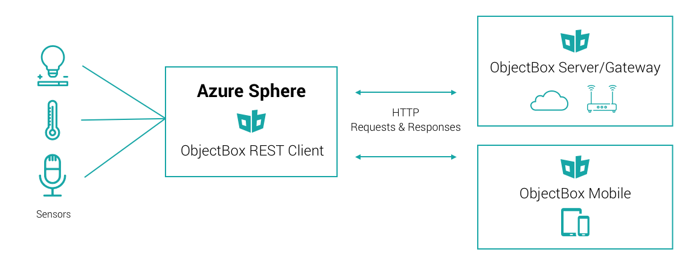

# ObjectBox client for Azure Sphere

For a general introduction to Azure Sphere and use cases in combination with [ObjectBox](https://objectbox.io/), check the [announcement post](https://objectbox.io/objectbox-on-azure-sphere-efficient-handling-of-persistent-iot-data-on-tiny-devices/). 

## Setup

For setting up the basic environment, please check out [the official installation instructions](https://docs.microsoft.com/en-us/azure-sphere/install/overview) for Azure Sphere by Microsoft.

Before running the demo application on the Azure Sphere development board, you need to start the ObjectBox HTTP database server with a database that has a schema which complies with the one in [`misc/TestEntity.fbs`](misc/TestEntity.fbs). Please see below for instructions on that.
After that, identify the server machine's IP address and edit the value of [`Capabilities.AllowedConnections` in `app_manifest.json`](azure-sphere-test/app_manifest.json#L8).
Because of its internal security features, the Azure Sphere device lets the demo application connect only to the IP addresses and hostnames specified here.

Next, assuming you have successfully attached the Azure Sphere development board to your computer, and it's connected to the internet or local network, you can open this project's `objectbox-azure-sphere.sln` solution in Visual Studio.
Finally, open the `azure-sphere-test` project, edit the `OBX_TEST_SERVER_IP` define in `main.c` accordingly and run it.
On success, it will output some demo information extracted from the database it connected to.

Now, you're ready to check out the other two demo projects, e.g. `azure-sphere-sensor-demo`. Assuming you already bought and connected the [_Grove Starter Kit for Azure Sphere_](https://www.seeedstudio.com/Grove-Starter-Kit-for-Azure-Sphere-MT3620-Development-Kit-p-3150.html), this project allows you to read out light, temperature and humidity data and store them in a database. Note that the database the server writes to has to have the [`SensorDemoEntity`](misc/SensorDemoEntity.fbs) schema.

The other project is `azure-sphere-compression-demo`. It demonstrates how serialized Flatbuffers data sent to the server can also be compressed. Right now, the HTTP server does not support that though, it's rather a demo of how libraries like Zstandard can be integrated into an Azure Sphere application. For reference, this demo uses the [`CompressionDemoEntity`](misc/CompressionDemoEntity.fbs) schema.

### Creating empty demo databases

For this task, the small C application in `misc/demo-db-creator` exists. First, run `download.sh` in there to automatically download the ObjectBox libraries, and then `make test-db`, `make sensor-demo-db` or `make compression-demo-db`. These Make targets automatically create the respective directories in `misc/demo-db-creator/dbs` and populate them with empty databases with the desired schema.

You don't need to do this to setup the project, as the directory `misc/demo-db-creator/dbs` already contains all three empty demo databases.

Note that creating new schemes is a bit cumbersome. To do that, you need to execute the following steps:

1. Create the desired Flatbuffers schema file as a FBS-file, just like in [`misc/TestEntity.fbs`](misc/TestEntity.fbs) for example.
2. Compile this schema into C files that can later be used by Azure Sphere itself. This requires the [`flatcc`](https://github.com/dvidelabs/flatcc#quickstart) utility, e.g. the command `flatcc MyNewEntity.fbs -a` and from the result you need the four files `flatbuffers_common_builder.h`, `flatbuffers_common_reader.h`, `MyNewEntity_builder.h` and `MyNewEntity_reader.h` to be part of your final Azure Sphere project.
3. Translate your initial schema into ObjectBox C code, similarly to the one found in [`misc/demo-db-creator/src/test-entity.c`](misc/demo-db-creator/src/test-entity.c). Upon executing this program after compilation, it creates a directory called `objectbox`. You can rename that if you want, just do not touch the files `data.mdb` and `lock.mdb` in it. The Makefile automizes all of that, i.e. you directly get the directory `misc/demo-db-creator/dbs/test-db` for example.

### Running the HTTP server

After creating an empty database (or just taking the ones provided already), you can run the HTTP server with that. To do that, run `download.sh` in this project's root directory, then execute `http-server/objectbox-http-server misc/demo-db-creator/dbs/test-db 8181` depending on which location you chose for your database and which port you'd like to use (8181 is the default for all Azure Sphere demo applications in this repository).

## Architecture

The image above illustrates how the Azure Sphere connects to a device running the ObjectBox HTTP server.
The "server" could also be an app running on a mobile phone;
example setups include direct connections via Wifi for smart home use cases.

During development, you can connect the Azure Sphere dev board to a server running on the development machine PC.
Just ensure both devices are running the same local network.
And, of course, you can connect the Azure Sphere to a production server on-premise or in the cloud.

The library `objectbox-client-azure-sphere` provided in this repository then connects to this server and exchanges data with it via a simple REST protocol.
Specifically, `GET` requests are used to get the number of entries in an entity or get a single or all entries.
`POST` is used for inserting data, updating entries uses `PUT`, and deleting them uses `DELETE`.

All payload of the various requests uses [FlatBuffers](https://google.github.io/flatbuffers/),
specifically [flatcc](https://github.com/dvidelabs/flatcc) for data serialization and deserialization.
The application running on the Azure Sphere device needs to know the data model in advance, e.g. by already being built with the compiled model.

## API

`objectbox-client-azure-sphere` gives developers the option to interact with the HTTP server using the following operations.
All methods, structs and error codes special to this library are prefixed with `obxc_`, `OBXC_` and `OBXC_`, respectively.
Identifiers that are used in other ObjectBox libraries as well, for example [objectbox-c](https://github.com/objectbox/objectbox-c),
use `obx_`, `OBX_` and `OBX_`, respectively.

### Initialization

First, an instance of the `OBXC_store_options` structure must be created. The following attributes must be set for that:

- `base_url`: The HTTP server's API base URL, e.g. `"http://192.168.178.54:8181/api/v2"`.
- `db`: The name of the desired database to connect to.
- `user` and `pass`: Username and password, respectively, needed to access the database.
  May be the empty string if no authentication is needed.
- `model.data` and `model.size`: For now always `NULL` and `0`, respectively.

After that, an instance of `OBXC_store*` can be created from these options using the function `OBXC_store* obxc_store_open(const OBXC_store_options* options)`.
It needs a pointer to a `OBXC_store_options` instance as its first and only parameter.
If the return value is `NULL`, creating the instance failed and further information may be obtained using the error handling methods presented below.

Finally, `obxc_store_close` must be used to correctly close the connection and deallocate all data associated with the store instance.

### General operations

All operations need a valid pointer to a `OBXC_store` instance as their first parameter to unambiguously identify the targeted database.

*`obx_err obxc_data_count(OBXC_store* store, int entityId, uint64_t* count)`*:
Counts the number of entries in the entity with id `entityId` and writes the result to the 64 bit integer value pointed to by `count`.

### Data retrieval

*`obx_err obxc_data_get(OBXC_store* store, int entityId, int id, OBXC_bytes* dest)`*
fetches the serialized FlatBuffers bytes of an entry with id `id` in the entity with id `entityId` into the buffer pointed to by `dest`.
The bytes can then be interpreted by feeding them through flatcc.
The result eventually needs to be deallocated using `obxc_bytes_free`.

*`obx_err obxc_data_get_all(OBXC_store* store, int entityId, OBXC_bytes_array* dest)`*
is similar to the previous function, but gets all entries associated with one entity.
This results also needs to be freed using `obxc_bytes_free`.

## Data modification

*`obx_err obxc_data_insert(OBXC_store* store, int entityId, const OBXC_bytes* src, int* id)`*
inserts a chunk of FlatBuffers-serialized data into the entity with id `entityId`.
The server will automatically assign a new, unique ID to the inserted entry, which will be returned by setting the integer pointed to by the `id` parameter.

*`obx_err obxc_data_update(OBXC_store* store, int entityId, int id, const OBXC_bytes* src)`* updates an entry in an entity with the given data.

*`obx_err obxc_data_delete(OBXC_store* store, int entityId, int id)`* deletes the respective entry from an entity.

### Error handling

All operations return [an error code](objectbox-client-azure-sphere/Inc/Public/objectbox.h#L42), which allows unified error handling.
A return value that is not `OBX_SUCCESS` indicates failure.
Alternatively, the last error code, as well as some more specific information, may be retrieved using the functions `obxc_last_error_code`, `obxc_last_error_message`, `obxc_last_error_secondary`, `obxc_last_error_clear`.
See the [demo application's source](azure-sphere-test/main.c) for a detailed example on how to correctly handle errors.

Note that all operations use the secondary error and the error message to store errors returned by the HTTP server.
This is, a HTTP code and a message explaining why the server rejected your request.

License
-------

    Copyright 2019 ObjectBox Ltd. All rights reserved.
    
    Licensed under the Apache License, Version 2.0 (the "License");
    you may not use this file except in compliance with the License.
    You may obtain a copy of the License at
    
        http://www.apache.org/licenses/LICENSE-2.0
    
    Unless required by applicable law or agreed to in writing, software
    distributed under the License is distributed on an "AS IS" BASIS,
    WITHOUT WARRANTIES OR CONDITIONS OF ANY KIND, either express or implied.
    See the License for the specific language governing permissions and
    limitations under the License.

